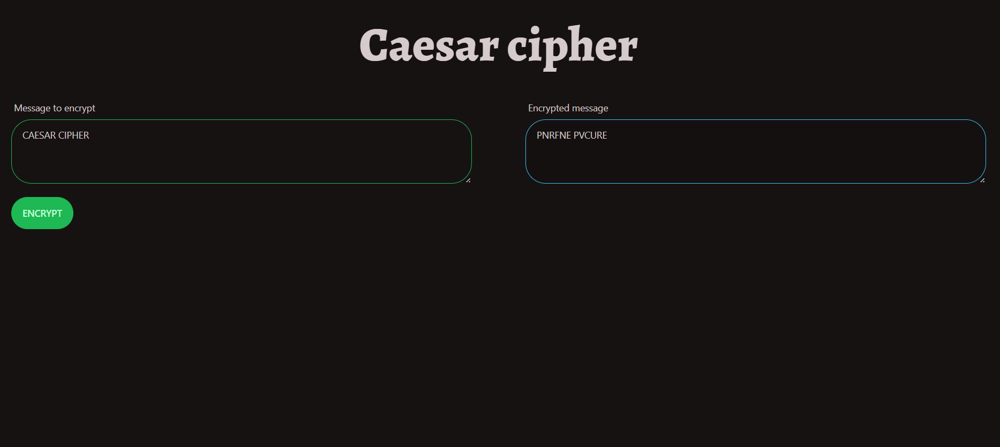

<div align="center">
<h1 align="center">Caesar Cipher</h1></div>



## Table of contents

* [General info](#general-info)
* [Demo](#demo)
* [Getting Started](#getting-started)
* [How to Use](#how-to-use)
* [Contact](#contact)

## General info

This project is an implementation of a simple encryption technique - the Caesar cipher - in JavaScript, using the Tailwind CSS library and daisyUI components for user interface styling.

## Demo

Check app demo [here.](https://ciphercaesar.netlify.app/)

## Getting Started

To run the project, follow these steps:

1. Move to directory `Caesar_Cipher`

```bash
cd Caesar_Cipher
```

2. Install the required dependencies using the command

```bash
npm install
```

3. Generate the Tailwind CSS file using the command

```bash
npm run build:tailwind
```

4. Open the `index.html` file in a web browser.

## How to Use

After running the project, you can enter text in the `Message to encrypt` field on the left. Then, you can click the green `ENCRYPT` button or type enter to get the encrypted message. The encrypted text will appear in the `Encrypted message` field on the right.

## Technologies

This project was written using the following technologies:

* JavaScript
* HTML
* CSS (with Tailwind CSS 3.2.X)
* DaisyUI 2.X

## Contact

Created by [@Gamattowicz](https://github.com/Gamattowicz) - feel free to contact me!
